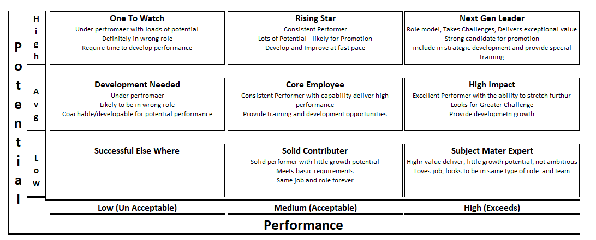

The 9-box model is used to assess employees based on their current performance and potential for future roles. It is typically used after the initial performance reviews and feedback collection.

- Goal Setting: Align employee goals with the criteria used in the 9-box grid (performance and potential).
- Ongoing Feedback: Provide feedback that addresses both performance and potential.
- Manager Evaluation: Managers use the 9-box model to categorize employees during the evaluation phase.
- Performance Review Meeting: Discuss the employee's placement on the 9-box grid and plan for development based on their position.